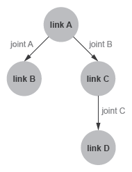

# Семинар №1. Знакомство с фреймворком программирования роботов ROS 2

## Задачи семинара:
 Теория
 - Познакомиться с назначением и основными возможностями фреймворка ROS2
 - Изучить базовые понятия и архитектуру фреймворка ROS2

 Практика
 - Освоить сборку и запуск готовых примеров приложений в ROS2
 - Освоить редактирование формата URDF

Данное руководство предоставляет краткую информацию, необходимую для выполнения задач семинара.

После прохождения семинара студенту необходимо составить отчет, в котором будет подробно изложена теоретическая  и практическая часть работы.

# Теория
ROS2 - фреймворк программирования систем управления роботов, являющийся второй версией самого популярного фреймворка программирования роботов ROS1.

Создаваемое с помощью ROS2 ПО представляет собой графоподобную структуру, где узлы (nodes) являются программами, которые выполняют решение независимых задач (захват изображения с камеры, прием данных с какого-либо сенсора, детекция объектов на изображении, расчет одометрии и т.д.). Ребрами графа являются каналы (topics) передачи данных (messages) между узлами с фиксированным типом данных.


## Команды:
```
ros2 run <package_name> <executable_name>
ros2 node list
ros2 node info <node_name>
ros2 topic list
ros2 topic echo <topic_name>
ros2 topic info <topic_name>
ros2 topic hz <topic_name>
```
Подробнее о узлах:
https://docs.ros.org/en/humble/Tutorials/Understanding-ROS2-Nodes.html

Подробнее о топиках:
https://docs.ros.org/en/humble/Tutorials/Topics/Understanding-ROS2-Topics.html

### Дополнительно:
> Подробнее о сервисах: https://docs.ros.org/en/humble/Tutorials/Services/Understanding-ROS2-Services.html
>
> Подробнее о параметрах: https://docs.ros.org/en/humble/Tutorials/Parameters/Understanding-ROS2-Parameters.html
>
> Подробнее о экшенах: https://docs.ros.org/en/humble/Tutorials/Understanding-ROS2-Actions.html

## Универсальный формат описания роботов `URDF`

URDF (Unified Robot Description Format) — спецификация XML, используемая в робототехнике для моделирования кинематических систем: манипуляторов, мобильных колесных и гусеничных роботов, гуманоидов и других механизмов.

Модель робота описывается xml-файлом с расширением `.urdf` (или `.xacro`). Формат позволяет описывать строго **древовидную структуру** робота, состоящую из xml элементов `<link>` и `<joint>`, где:
* `<link>` — твердое тело (звено);
* `<joint>` — кинематическая связь (шарнир/сустав) между родительским телом (`parent`) и дочерним (`child`).

> [!IMPORTANT]
> **Важнейшее правило URDF**: Модель робота в URDF может быть только **строгим кинематическим деревом** (Directed Tree). 
> - Каждое звено (`link`), кроме корневого, должно иметь **ровно одного родителя** (`parent`).
> - Замкнутые кинематические цепи (closed loops / циклы, когда звено соединено сразу с двумя родителями) в стандарте URDF **запрещены**.



Например, корректная структура файла URDF для древовидной кинематической структуры с рисунка выше (где `link_A` — корень, от которого отходят `link_B` и `link_C`, а к `link_C` крепится `link_D`):
```xml
<robot name="tree_robot">
    <!-- Звенья робота -->
    <link name="link_A">
        <!-- визуальные, коллизионные и инерционные параметры -->
    </link>
    <link name="link_B">
    </link>
    <link name="link_C">
    </link>
    <link name="link_D">
    </link>

    <!-- Кинематические связи (суставы) -->
    <joint name="joint_AB" type="revolute">
        <parent link="link_A"/>
        <child link="link_B"/>
        <axis xyz="0 0 1"/>
        <limit lower="-1.57" upper="1.57" effort="10.0" velocity="1.0"/>
    </joint>

    <joint name="joint_AC" type="revolute">
        <parent link="link_A"/>
        <child link="link_C"/>
        <axis xyz="0 0 1"/>
        <limit lower="-1.57" upper="1.57" effort="10.0" velocity="1.0"/>
    </joint>

    <joint name="joint_CD" type="revolute">
        <parent link="link_C"/>
        <child link="link_D"/>
        <axis xyz="0 1 0"/>
        <limit lower="-1.57" upper="1.57" effort="10.0" velocity="1.0"/>
    </joint>
</robot>
```

Каждый link обычно содержит элементы `<inertial>`, `<visual>`, `<collision>`:
```xml
<link name="sample_link">
    <inertial>
        <mass value="1.0"/>
        <inertia ixx="0.01" ixy="0.0" ixz="0.0" iyy="0.01" iyz="0.0" izz="0.01"/>
    </inertial>
    <visual>
        <geometry>
            <cylinder length="0.6" radius="0.1"/>
        </geometry>
        <material name="blue">
            <color rgba="0 0 0.8 1"/>
        </material>
    </visual>
    <collision>
        <geometry>
            <cylinder length="0.6" radius="0.1"/>
        </geometry>
    </collision>
</link>
```

* `<visual>` определяет внешний вид описываемого тела (геометрию, цвет, меши `.stl` или `.dae`),
* `<inertial>` определяет массу и тензор моментов инерции (необходимы для физической симуляции динамики),
* `<collision>` определяет геометрию для расчета столкновений (коллизий) тел в симуляторе.

---

## В чем разница между `joint_state_publisher` и `robot_state_publisher`?

Это два фундаментальных, но совершенно разных пакета экосистемы ROS 2, работающих в связке:

1. **`joint_state_publisher` (и его GUI-версия `joint_state_publisher_gui`):**
   * **Что делает:** опрашивает или задает текущие углы/смещения подвижных суставов робота.
   * **Что публикует:** публикует сообщение типа `sensor_msgs/msg/JointState` в топик `/joint_states`.
   * В GUI-режиме предоставляет ползунки, позволяющие вручную вращать сочленения модели.

2. **`robot_state_publisher`:**
   * **Что делает:** считывает XML-текст модели робота из параметра `robot_description`, подписывается на топик `/joint_states` и вычисляет прямую задачу кинематики (Forward Kinematics) с помощью KDL (Kinematics and Dynamics Library).
   * **Что публикует:** рассылает пространственные координаты и ориентацию всех звеньев робота в виде дерева координат в топики `/tf` и `/tf_static`.
   * Без `robot_state_publisher` RViz2 не сможет построить пространственную структуру робота и выдаст ошибку `No transform from [link] to [base_link]`.

**Пайплайн отображения робота в ROS 2:**
```
[joint_state_publisher_gui]
           |
   (topic: /joint_states)
           v
 [robot_state_publisher]  <---  (param: robot_description [URDF])
           |
     (topic: /tf)
           v
        [RViz2]
```

### Источники:
- https://wiki.ros.org/urdf/Tutorials
- https://docs.ros.org/en/humble/Tutorials/Intermediate/URDF/Using-URDF-with-Robot-State-Publisher.html
- https://docs.exponenta.ru/physmod/sm/ug/urdf-model-import.html

# Практическая часть работы:

## Задание №1. Знакомство с консольными командами ROS 2.

На примере стандартного пакета __demo_nodes_cpp__ и приложений __talker__ и __listener__ запустить команды (см. Команды). Описать что делает каждая команда. Приложить в отчете вывод каждой команды.

> Команду `ros2 run` для __talker__ и __listener__ запускать в отдельных терминалах. Остальные команды, запускать в третьем терминале. Обьяснить в отчете, зачем это делать? Название топика (<topic_name>) узнать с помощью одной из этих команд.


## Задание №2. Turtlesim (робот черепаха 2d)
https://docs.ros.org/en/humble/Tutorials/Beginner-CLI-Tools/Introducing-Turtlesim/Introducing-Turtlesim.html

Запуск черепашки:

```bash
ros2 run turtlesim turtlesim_node
```

Управление черепашкой (открыть в другом терминале):
```bash
ros2 run turtlesim turtle_teleop_key
```

Изучение средств разработчика RQt. Запустить в еще одном терминале:
```bash
rqt
```

В открывшемся окне изучить меню plugins. Открыть плагин node_graph, что вы видите? Запишите в отчет.

В отчете отразить как именно происходит управление черепашкой. Перечислить список узлов, топиков. Описать какой узел что делает, какие данные отправляет и принимает. Приложить скриншот rqt_graph (запуск с помощью `ros2 run rqt_graph rqt_graph` или из `rqt`)

## Задание №3. Универсальный формат описания роботов (URDF). Робот R2D2.

https://docs.ros.org/en/humble/Tutorials/Intermediate/URDF/Using-URDF-with-Robot-State-Publisher.html

Перейти в папку заранее созданного рабочего окружения:

```bash
cd ~/ros2_seminars_ws
```
Вывести, с помощью команды `ls`, какие папки находятся в __ros2_seminars_ws__

Запустить демонстрационное приложение

```bash
ros2 launch urdf_tutorial demo.launch.py
```

В отдельном терминале запустить:
```bash
rviz2 -d ~/ros2_seminars_ws/install/urdf_tutorial/share/urdf_tutorial/r2d2.rviz
```

Изучить URDF файл робота R2D2.
Файл находится по адресу
`~/ros2_seminars_ws/src/ros2-urdf-tutorial/urdf_tutorial/urdf/r2d2.urdf.xml`.

В отчете перечислить (названия) из каких тел состоит робот, какие свойства у этих тел. Какими связями они соединены (какие типы связей используются и почему).

## Задание №4. Модификация кинематической модели робота R2D2 (на 45 баллов)

Для подтверждения практических навыков редактирования URDF выполните автономную модификацию кинематического описания R2D2.

1. Откройте файл модели:
   `src/ros2-urdf-tutorial/urdf_tutorial/urdf/r2d2.urdf.xml`

2. Добавьте роботу сканирующий датчик-перископ на купол головы (`head`):
   * **Новое звено `periscope`:** цилиндрической формы с радиусом `0.02` м, длиной `0.15` м и ярким цветом (красный: `<color rgba="1 0 0 1"/>`):
     ```xml
     <link name="periscope">
       <visual>
         <geometry>
           <cylinder length="0.15" radius="0.02"/>
         </geometry>
         <origin xyz="0 0 0.075" rpy="0 0 0"/>
         <material name="red">
           <color rgba="1 0 0 1"/>
         </material>
       </visual>
       <collision>
         <geometry>
           <cylinder length="0.15" radius="0.02"/>
         </geometry>
         <origin xyz="0 0 0.075" rpy="0 0 0"/>
       </collision>
     </link>
     ```
   * **Новое призматическое сочленение `periscope_joint`:** закреплено на голове робота (`<parent link="head"/>`), дочернее звено — `<child link="periscope"/>`, ось выдвижения вверх по оси $Z$ (`<axis xyz="0 0 1"/>`) с лимитами от `0` до `0.15` м:
     ```xml
     <joint name="periscope_joint" type="prismatic">
       <parent link="head"/>
       <child link="periscope"/>
       <origin xyz="0 0 0.2" rpy="0 0 0"/>
       <axis xyz="0 0 1"/>
       <limit lower="0" upper="0.15" effort="10" velocity="0.5"/>
     </joint>
     ```

3. Для применения изменений пересоберите пакет:
   ```bash
   colcon build --packages-select urdf_tutorial
   source install/setup.bash
   ```

4. Запустите обновленную модель:
   ```bash
   ros2 launch urdf_tutorial demo.launch.py
   ```

5. В окне графического интерфейса `Joint State Publisher` найдите ползунок нового сочленения `periscope_joint`, выдвиньте его на максимум и зафиксируйте результат. Сгенерируйте обновленное дерево TF:
   ```bash
   ros2 run tf2_tools view_frames
   ```

6. Отразите в отчете: листинг добавленного XML-кода, скриншот робота с выдвинутым красным перископом в RViz2 и схему дерева TF.

---

# Оценивание

По результатам выполнения работы оформляется структурированный отчет (в формате PDF или Markdown) и отсылается преподавателю: **mail@borislap.ru**.

> [!NOTE]
> Семинар №0 и Семинар №1 формируют **Модуль 1**. Итоговая оценка за стандартный трек модуля рассчитывается как среднее арифметическое оценок за два семинара: $\text{Модуль 1} = \frac{\text{Сем 0} + \text{Сем 1}}{2} \le 45$ баллов.

---

### Стандартный трек (от 35 до 45 баллов)

* **`35 баллов` — Базовый оформленный отчет (Задания 1, 2, 3):**
  * Теория **своими словами**: сущности графа ROS 2 (узлы, топики, типы сообщений), назначение команд CLI.
  * Принципиальная разница между `joint_state_publisher` и `robot_state_publisher`.
  * Скриншоты управления черепашкой `turtlesim` и граф `rqt_graph`.
  * Подробное описание кинематической цепи исходного робота R2D2 (названия звеньев, типы связей).

* **`до 45 баллов` — Полный отчет с выполненным Заданием №4:**
  * Успешно внесенные изменения в URDF-модель робота R2D2 (добавление звена `periscope` и сочленения `periscope_joint`).
  * Приложенный скриншот работы модели в RViz2 с выдвинутым суставом.
  * Приложенный сгенерированный граф дерева трансформаций `frames.pdf` с подтверждением связи `head -> periscope`.

---

### Продвинутый трек (54 балла — Оценка «Отлично»)

Для получения оценки **54 балла** за весь Модуль 1 (без необходимости сдачи стандартных отчетов по Семинарам 0 и 1) выполняется одно из 15 индивидуальных проектных заданий повышенной сложности:
👉 **См. документ [ИНДИВИДУАЛЬНЫЕ_ЗАДАНИЯ.md](ИНДИВИДУАЛЬНЫЕ_ЗАДАНИЯ.md)**.


