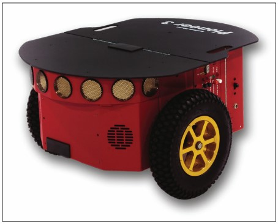

# Семинар №2. Моделирование роботов в ROS2 + Gazebo

## Задачи семинара:
 Теория
 - Познакомиться с принципами моделирования роботов в ROS2
 - Изучить универсальный формат описания роботов URDF

 Практика
 - Освоить запуск симуляции на примере робота TurtleBot3 в ROS2
 - Осуществить запуск симуляции для своей URDF модели робота в ROS2

Данное руководство предоставляет краткую информацию, необходимую для выполнения задач семинара.

После прохождения семинара студенту необходимо составить отчет, в котором будет подробно изложена теоретическая  и практическая часть работы.

# Теория

## XACRO

`XACRO` расширяет возможности xml и упрощает составление URDF моделей, увеличивает читаемость и редактируемость моделей.

### Параметры:
```xml
<xacro:property name="the_radius" value="2.1" />
<xacro:property name="the_length" value="4.5" />

<geometry type="cylinder" radius="${the_radius}" length="${the_length}" />
```

### Математические выражения:
```xml
<xacro:property name="radius" value="4.3" />
<circle diameter="${2 * radius}" />
```
### Макросы:
```xml
<xacro:macro name="circle_x2" params="radius">
	<circle diameter="${2 * radius}" />
</xacro:macro>

<xacro:circle_x2 radius="12" />
```

### Источники:
- https://wiki.ros.org/xacro


## Gazebo в URDF:

Формат URDF при использовыании в Gazebo, поддерживает дополнительные возможности, описываемые внутри элементов `<gazebo>`. Основыными такими возможностями является поддержка различных сенсоров (камер, лидаров, дальномеров и т.д.), контроллеров для реализации той или иной модели управления и возможности по описанию свойств тел (материала, коэфф. трения и т.д.).



Например, вот так выглядит описание diff_drive_controller, это контроллер позволяющий управлять моделью робота с дифференциальным приводом шасси (см. рис. выше) Обычно это два симметрично расположенных на неподвижных осях колеса, которые управляются независимо.

```xml
<gazebo>
    <plugin filename="libgazebo_ros_diff_drive.so" name="differential_drive_controller">

      <ros>
        <namespace>/</namespace>
      </ros>

      <!-- wheels -->
      <left_joint>drivewhl_l_joint</left_joint>
      <right_joint>drivewhl_r_joint</right_joint>

      <!-- kinematics -->
      <wheel_separation>${base_width+wheel_ygap}</wheel_separation>
      <wheel_diameter>${wheel_radius*2}</wheel_diameter>

      <!-- limits -->
      <max_wheel_torque>20.0</max_wheel_torque>
      <max_wheel_acceleration>1.0</max_wheel_acceleration>

      <!-- output -->
      <publish_odom>true</publish_odom>
      <publish_odom_tf>true</publish_odom_tf>

      <odometry_frame>odom</odometry_frame>
      <robot_base_frame>base_footprint</robot_base_frame>
    </plugin>
  </gazebo>
```

Список имеющихся в системе плагинов можно узнать с помощью команды:
```bash
ls /opt/ros/humble/lib | grep libgazebo_ros
```
Примеры использования:
https://www.gazebosim.org/tutorials?tut=ros_gzplugins


# Практическая часть работы:

## Задание №1. Запуск симуляции робота TurtleBot3 в Gazebo (URDF для ROS2 и SDF для Gazebo)

https://emanual.robotis.com/docs/en/platform/turtlebot3/simulation/#gazebo-simulation

Добавить дополнительный путь поиска моделей роботов для симулятора Gazebo:

```bash
export GAZEBO_MODEL_PATH=$GAZEBO_MODEL_PATH:/opt/ros/humble/share/turtlebot3_gazebo/models/
```

Определить тип робота (доступны `burger`, `waffle`, `waffle_pi`):
```bash
export TURTLEBOT3_MODEL=burger
```

Запустить симуляцию с пустой картой:
```bash
ros2 launch turtlebot3_gazebo empty_world.launch.py
```

Доступны к запуску симуляция для двух карт `turtlebot3_world` и `turtlebot3_house`:

```bash
ros2 launch turtlebot3_gazebo turtlebot3_world.launch.py
ros2 launch turtlebot3_gazebo turtlebot3_house.launch.py
```

Осуществить управление роботом, для этого в другом терминале запустить:
```bash
export TURTLEBOT3_MODEL=burger
ros2 run turtlebot3_teleop teleop_keyboard
```

Открыть rviz2, чтобы увидеть то, что "видит" робот своими датчиками.
```
rviz2 -d /opt/ros/humble/share/turtlebot3_gazebo/rviz/tb3_gazebo.rviz
```


## Задание №2. Запуск симуляции робота описанного URDF+XACRO (без SDF)

Запустить симуляцию:
```bash
ros2 launch basic_mobile_robot basic_mobile_bot.launch.py
```

Убедиться в корректности отображения двухколесного робота в окне симулятора Gazebo и в окне RViz.

Осуществить управление роботом с помощью `rqt_robot_steering`
```bash
ros2 run rqt_robot_steering rqt_robot_steering --force-discover
```

Изучить URDF модель робота:
`~/ros2_seminars_ws/src/basic_mobile_robot/models/basic_mobile_bot.xacro.urdf`

# Индивидуальное задание

Создать своего уникального робота, успешно запустить его в Gazebo.

# Оценивание

__`35 баллов`. Оформленный отчет.__

В котором должна быть:
- Своими словами описана теория,
- Подробное описание практики.

__`45 баллов`. Простейшая модель уникального робота.__

Робот идентичен по структуре учебному примеру. Дифференциальный привод. Отсутствие сенсоров.

__`54 балла`. Сложная модель уникального робота.__
Робот должен дополнительно содержать любой из доступных сенсоров (IMU, LIDAR, CAMERA, BUMPER, DEPTH CAMERA, ACERMANN DRIVE и т.п.). Нужно показать что сенсор работает и публикует данные в ROS 2.

