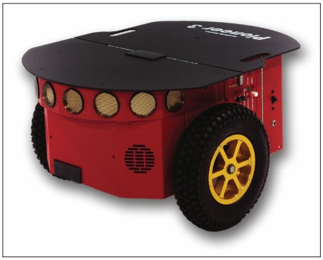

# Семинар №3. Моделирование и управление мобильным манипулятором KUKA YouBot в симуляторе Gazebo

## Задачи семинара:
### Теория:
- Изучить кинематику и структуру мобильного робота-манипулятора KUKA YouBot.
- Разобрать принципы раздельного и совместного управления мобильной платформой и 5-осевым манипулятором в среде ROS 2 и Gazebo.
- Освоить работу с интерфейсом траекторий сочленений (`trajectory_msgs/msg/JointTrajectory`).

### Практика:
- Освоить запуск комплексной физической симуляции YouBot в симуляторе Gazebo с синхронной визуализацией в RViz2.
- Научиться управлять движением всенаправленной колесной платформы (Omnidirectional Planar Move).
- Освоить отправку команд управления суставами манипулятора через топики ROS 2.
- Разработать на Python автономный узел планирования и плавного исполнения траектории манипулятора.

---

# Теория

## 1. Кинематическая архитектура KUKA YouBot

KUKA YouBot — это классическая учебная и исследовательская платформа мобильной манипуляции, состоящая из двух основных подсистем:
1. **Всенаправленная колесная база**: оснащена 4 колесами типа Mecanum (роликовые колеса), что позволяет роботу перемещаться в плоскости в любом направлении (вперед/назад, боковое смещение/strafe, поворот на месте) с 3 степенями свободы ($x, y, \theta$).
2. **5-осевой манипулятор (YouBot Arm)**: последовательный кинематический манипулятор с 5 вращательными суставами (`arm_joint_1` – `arm_joint_5`) и двухпальцевым параллельным захватом (gripper).



---

## 2. Архитектура симуляции YouBot в Gazebo

В симуляторе Gazebo робот оснащен набором стандартных плагинов `gazebo_ros_pkgs`:

```
                                +-----------------------------------+
                                |          Симулятор Gazebo         |
                                |                                   |
[teleop_twist_keyboard] ------->| /youbot/cmd_vel                   |
  (geometry_msgs/Twist)         |   (плагин: planar_move)           |
                                |                                   |
[Python Trajectory Node] ------>| /youbot/set_joint_trajectory      |
  (trajectory_msgs/             |   (плагин: joint_pose_trajectory) |
     JointTrajectory)           |                                   |
                                | /youbot/joint_states              |
                                +-----------------+-----------------+
                                                  |
                                                  v  (sensor_msgs/JointState)
                                        [robot_state_publisher]
                                                  |
                                                  v  (tf / tf_static)
                                              [RViz2]
```

1. **Плагин движения базы (`libgazebo_ros_planar_move.so`)**:
   * Топик: `/youbot/cmd_vel`
   * Тип сообщения: `geometry_msgs/msg/Twist`
   * Позволяет независимо задавать линейные скорости $v_x, v_y$ и угловую скорость $\omega_z$.

2. **Плагин управления суставами манипулятора (`libgazebo_ros_joint_pose_trajectory.so`)**:
   * Топик: `/youbot/set_joint_trajectory`
   * Тип сообщения: `trajectory_msgs/msg/JointTrajectory`
   * Принимает список целевых суставов и массив точек траектории с временными метками `time_from_start`.

3. **Плагин публикации состояния суставов (`libgazebo_ros_joint_state_publisher.so`)**:
   * Топик: `/youbot/joint_states`
   * Публикует актуальные углы поворота всех подвижных сочленений, считываемые `robot_state_publisher` для построения дерева `/tf`.

---

## 3. Интерфейс `JointTrajectory`

Сообщение `trajectory_msgs/msg/JointTrajectory` является стандартом ROS 2 для управления манипуляторами. Оно включает:
* `header`: временная метка и система отсчета;
* `joint_names`: строковый массив названий управляемых сочленений:
  `['arm_joint_1', 'arm_joint_2', 'arm_joint_3', 'arm_joint_4', 'arm_joint_5']`;
* `points`: массив точек траектории типа `trajectory_msgs/msg/JointTrajectoryPoint`:
  * `positions`: целевые углы сочленений в радианах;
  * `velocities`: (опционально) желаемые угловые скорости;
  * `time_from_start`: время (в секундах / наносекундах от старта), за которое звено должно прийти в данную точку.

Пределы вращения суставов руки YouBot (в градусах и радианах):
* `arm_joint_1`: от $-169^\circ$ до $+169^\circ$ (поворот основания манипулятора вокруг оси $Z$);
* `arm_joint_2`: от $-65^\circ$ до $+90^\circ$ (плечевой сустав);
* `arm_joint_3`: от $-151^\circ$ до $+146^\circ$ (локтевой сустав);
* `arm_joint_4`: от $-102^\circ$ до $+102^\circ$ (наклон запястья);
* `arm_joint_5`: от $-167^\circ$ до $+167^\circ$ (вращение запястья/фланца).

---

# Практическая часть работы: 4 задания

> **Подготовка окружения:**  
> Все команды выполняются внутри контейнера Docker (`.devcontainer` в VS Code или запуск через `./run_in_docker.sh`). Перед запуском команд убедитесь, что воркспейс собран и окружение подключено:
> ```bash
> source /opt/ros/humble/setup.bash
> cd /workspaces/ros2_seminars_ws  # либо ~/ros2_seminars_ws
> colcon build --symlink-install
> source install/setup.bash
> ```

---

## Задание №1. Запуск симуляции YouBot в Gazebo и визуализация в RViz2

В первом задании необходимо запустить физическую симуляцию YouBot и исследовать структуру графа ROS 2.

1. Запустите комплексный launch-файл симуляции:
   ```bash
   ros2 launch youbot_description youbot_gazebo.launch.py
   ```
   Откроются два окна:
   * Симулятор **Gazebo** с физической моделью робота в мире `world.sdf`.
   * Окно **RViz2** с кинематической моделью робота, визуализацией сетки и координатных осей.

2. В новом терминале проверьте список активных узлов и топиков:
   ```bash
   ros2 node list
   ros2 topic list
   ```

3. Проверьте публикацию состояния суставов робота:
   ```bash
   ros2 topic echo /youbot/joint_states --once
   ```

4. Постройте и сохраните дерево систем координат TF:
   ```bash
   ros2 run tf2_tools view_frames
   ```
   Команда сгенерирует файл `frames.pdf`. Изучите цепочку трансформаций от `world` до `arm_link_5` и зафиксируйте ее в отчете.

---

## Задание №2. Управление движением мобильной платформы YouBot

Платформа YouBot обладает свойством всенаправленности (Omnidirectional drive).

1. Не закрывая симулятор, откройте новый терминал и запустите узел управления с клавиатуры, перенаправив топик скорости:
   ```bash
   ros2 run teleop_twist_keyboard teleop_twist_keyboard --ros-args -r cmd_vel:=/youbot/cmd_vel
   ```

2. Опробуйте управление платформой:
   * `i` / `,` — движение вперед / назад;
   * `j` / `l` — вращение влево / вправо;
   * `u` / `o` / `m` / `.` — диагональное движение;
   * `Shift + J` / `Shift + L` — боковое смещение (strafe влево и вправо) **без разворота корпуса**.

3. Запустите графическую панель RQt для мониторинга:
   ```bash
   ros2 run rqt_graph rqt_graph
   ```
   Сделайте скриншот связей между узлом `teleop_twist_keyboard` и плагином Gazebo.

---

## Задание №3. Прямое управление манипулятором через топик траекторий

Научитесь передавать команды в сочленения манипулятора напрямую через интерфейс командной строки ROS 2.

> [!NOTE]
> В симуляторе Gazebo Classic плагин `gazebo_ros_joint_pose_trajectory` ожидает:
> 1. Базовый фрейм отсчета в заголовке сообщения: `frame_id: 'world'`.
> 2. Имена сочленений с учетом пространства имен модели: `youbot::arm_joint_1` ... `youbot::arm_joint_5`.
> 3. По умолчанию в симуляторе включена физика гравитации ODE. При единичной отправке (`--once`) плагин разово выставляет позу, после чего звенья под собственным весом опускаются. Для удержания манипулятора в заданной позе из CLI используется циклическая публикация с частотой 10 Гц (`-r 10`).

1. Отправьте команду перемещения манипулятора в устойчивую позу (углы в радианах: `[0.0, 0.5, -0.8, 0.3, 0.0]`) и зафиксируйте ее с частотой 10 Гц:
   ```bash
   ros2 topic pub -r 10 /youbot/set_joint_trajectory trajectory_msgs/msg/JointTrajectory "{
     header: {stamp: {sec: 0, nanosec: 0}, frame_id: 'world'},
     joint_names: ['youbot::arm_joint_1', 'youbot::arm_joint_2', 'youbot::arm_joint_3', 'youbot::arm_joint_4', 'youbot::arm_joint_5'],
     points: [{positions: [0.0, 0.5, -0.8, 0.3, 0.0], time_from_start: {sec: 0, nanosec: 100000000}}]
   }"
   ```
   *(Для разового выставления позы можно использовать флаг `--once`).*

2. Убедитесь, что манипулятор в окне Gazebo занял заданное положение, а в RViz2 отобразилась соответствующая поза (узлы RViz2 и `robot_state_publisher` автоматически связывают состояние суставов с TF-деревом модели).

3. Проверьте текущие углы сочленений в топике:
   ```bash
   ros2 topic echo /youbot/joint_states --once
   ```

4. Попробуйте поочередно изменить угол поворота первого сустава (`youbot::arm_joint_1`, вращение вокруг вертикали, пределы $[0; 5.89]$ рад) и третьего (`youbot::arm_joint_3`, локоть, пределы $[-5.18; 0]$ рад). Запишите в отчет, как изменились углы в `/youbot/joint_states`.

---

## Задание №4. Программирование автономного сценария движения манипулятора на Python

В этом задании студенту предстоит реализовать собственный алгоритм перемещения рабочего органа робота (рисование геометрической фигуры или танец манипулятора) путем генерации последовательности точек траектории.

1. Ознакомьтесь с эталонным скриптом узла:
   `src/youbot_description/scripts/state_publisher.py`

2. Запустите скрипт:
   ```bash
   ros2 run youbot_description state_publisher.py
   ```
   Манипулятор начнет выполнять запрограммированную серию движений с автоматической линейной интерполяцией углов во времени.

3. **Индивидуальное творческое задание:**  
   Отредактируйте массив `DEFAULT_PATH` внутри `src/youbot_description/scripts/state_publisher.py`, чтобы робот нарисовал рабочим органом в воздухе фигуру в соответствии с вашим вариантом:
   * **Вариант 1**: Буква вашего имени (не менее 4 опорных точек).
   * **Вариант 2**: Прямоугольник / треугольник в вертикальной плоскости.
   * **Вариант 3**: Синусоидальное волнообразное движение фланца манипулятора.
   * **Вариант 4**: Сценарий захвата воображаемого объекта с пола и переноса его на платформу робота (Pick & Place cycle).

4. Зафиксируйте траекторию на видео или сделайте серию скриншотов с промежуточными положениями манипулятора в симуляторе.

---

# Оценивание

По результатам выполнения работы оформляется структурированный отчет (в формате PDF или Markdown) и отсылается преподавателю: **mail@borislap.ru**.

> [!NOTE]
> Семинар №2 и Семинар №3 формируют **Модуль 2**. Итоговая оценка за стандартный трек модуля рассчитывается как среднее арифметическое оценок за два семинара: $\text{Модуль 2} = \frac{\text{Сем 2} + \text{Сем 3}}{2} \le 45$ баллов.

---

### Стандартный трек (от 35 до 45 баллов)

* **`35 баллов` — Базовый оформленный отчет (Задания 1 и 2):**
  * Теоретическое описание кинематической схемы KUKA YouBot, принципа работы Mecanum-колес и плагина `planar_move`.
  * Скриншоты работающей симуляции YouBot в Gazebo и RViz2.
  * Приложенный сгенерированный граф `frames.pdf` (TF tree) и `rqt_graph`.
  * Демонстрация омни-управления платформой во всех направлениях (включая боковой strafe).

* **`до 45 баллов` — Полный отчет (Задания 1, 2, 3 и 4):**
  * Успешная отправка траекторных команд в сочленения манипулятора `/youbot/set_joint_trajectory` из консоли с фиксацией позы (`-r 10`) и подтверждением изменения углов в `/youbot/joint_states`.
  * Запуск и демонстрация работы автономного узла `state_publisher.py` с модифицированным массивом `DEFAULT_PATH` под выбранную фигуру (буква имени, прямоугольник, синусоида или pick-and-place).
  * Серия скриншотов движения манипулятора в Gazebo без резких рывков и коллизий.

---

### Продвинутый трек (54 балла — Оценка «Отлично»)

Для получения оценки **54 балла** за весь Модуль 2 (без необходимости сдачи стандартных отчетов по Семинарам 2 и 3) выполняется одно из 15 индивидуальных проектных заданий повышенной сложности:
👉 **См. документ [ИНДИВИДУАЛЬНЫЕ_ЗАДАНИЯ.md](ИНДИВИДУАЛЬНЫЕ_ЗАДАНИЯ.md)**.