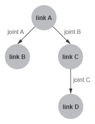

# Семинар №1. Знакомство с фреймворком программирования роботов ROS 2

## Задачи семинара:
 Теория
 - Познакомиться с назначением и основными возможностями фреймворка ROS2
 - Изучить базовые понятия и архитектуру фреймворка ROS2

 Практика
 - Освоить сборку и запуск готовых примеров приложений в ROS2

Данное руководство предоставляет краткую информацию, необходимую для выполнения задач семинара.

После прохождения семинара студенту необходимо составить отчет, в котором будет подробно изложена теоретическая  и практическая часть работы.

# Теория
ПО в ROS2 представляет собой графоподобную структуру, где узлы (nodes) являются программами, которые выполняют решение независимых задач (захват изображения с камеры, прием данных с какого-либо сенсора, детекция обьектов на изображении, расчет одометрии и т.д.). Ребрами графа являются каналы (topics) передачи данных (messages) между узлами с фиксированным типом данных.


## Команды:
```
ros2 run <package_name> <executable_name>
ros2 node list
ros2 node info <node_name>
ros2 topic list
ros2 topic echo <topic_name>
ros2 topic info <topic_name>
ros2 topic pub <topic_name> <msg_type> '<args>'
ros2 topic hz <topic_name>
```
Подробнее об узлах:
https://docs.ros.org/en/dashing/Tutorials/Understanding-ROS2-Nodes.html

Подробнее о топиках:
https://docs.ros.org/en/dashing/Tutorials/Topics/Understanding-ROS2-Topics.html

### Дополнительно:
> Подробнее о сервисах: https://docs.ros.org/en/dashing/Tutorials/Services/Understanding-ROS2-Services.html
>
> Подробнее о параметрах: https://docs.ros.org/en/dashing/Tutorials/Parameters/Understanding-ROS2-Parameters.html
>
> Подробнее о экшенах: https://docs.ros.org/en/dashing/Tutorials/Understanding-ROS2-Actions.html

## Универсальный формат описания роботов `URDF`

URDF, является спецификацией XML, используемой в академической среде и промышленности для моделирования систем мультител, таких как руки роботов-манипуляторов, гуманоидных роботов, мобильных колесных и гусеничных роботов и т.д.. URDF особенно популярен у пользователей ROS.

Модель робота описывается xml файлом с расширением .urdf. Формат позволяет описывать древовидную структуру робота состоящего из xml элементов `<link>` и `<joint>`, где link описывает тело, а joint кинематическую связь между телами.



Например, типичная структура файла urdf для структуры робота на рисунке выше:
```xml
<robot name = "linkage">
    <link name = "joint A">
		...
	</link>
    <link name = "joint B">
		...
	</link>
    <link name = "joint C">
		...
	</link>
    <link name = "joint D">
		...
	</link>
	<joint name = "joint A">
		<parent link = "link A" />
		<child link = "link B" />
	</joint>
	<joint name = "joint B">
		<parent link = "link A" />
		<child link = "link C" />
	</joint>
	<joint name = "joint C">
		<parent link = "link C" />
		<child link = "link D" />
	</joint>
	<joint name = "joint D">
		<parent link = "link B" />
		<child link = "link D" />
	</joint>
</robot>
```

При этом, каждый link обычно содержит элементы `<inertial>`, `<visual>`, `<collision>`:
```xml
<link>
    <inertial>
        ...
    </inertial>
    <visual>
        <geometry>
            ...
        </geometry>
        <material>
            <color />
        </material>
    </visual>
</link>
```

`<visual>` определеяет внешний вид описываемого тела,

`<inertial>` определяет инерцию (моменты инерции),

`<collision>` позволяет описать столкновения с телом (коллизии).

В процессе работы мы познакомимся с форматом `XACRO`, который расширяет возможности xml и позволяет использовать макросы. Это упрощает составление URDF моделей, увеличивает читаемость и редактируемость моделей.

### Источники:
- https://wiki.ros.org/urdf/Tutorials
- https://docs.exponenta.ru/physmod/sm/ug/urdf-model-import.html

# Практическая часть работы:

## Установка ROS2 (версия dashing) на Ubuntu Linux 18.04

В случае, если вы используете личный компьютер, выполнить:
> Загружаем workspace для семинаров:
> ```
> git clone https://github.com/MrBoriska/ros2_seminars_ws.git --recursive
> ```
> 
> Запускаем скрипт установки ROS2:
> 
> ```
> ./ros2_seminars_ws/install_ros2_dashing.sh
> ```


Убедиться в корректности запуска и работы примеров `talker` и `listener`:

talker:
```
ros2 run demo_nodes_cpp talker
```
В другом терминале listener:
```
ros2 run demo_nodes_py listener
```

Вы должны увидеть, что __talker__ выводит в консоль сообщения `Publishing`, а __listener__ сообщения `I heard`.

## Задание №1. Turtlesim (робот черепаха 2d)
https://docs.ros.org/en/dashing/Tutorials/Turtlesim/Introducing-Turtlesim.html
```
cd ~/ros2_seminars_ws
rosdep install -i --from-path src --rosdistro dashing -y
colcon build --symlink-install --packages-select turtlesim
. install/local_setup.bash
```

Запуск черепашки:

```
ros2 run turtlesim turtlesim_node
```

Управление черепашкой:
```
ros2 run turtlesim turtle_teleop_key
```

Изучение средств разработчика RQt
```
rqt
```

В отчете отразить как именно происходит управление черепашкой. Перечислить список узлов, топиков. Описать какой узел что делает, какие данные отправляет и принимает. Приложить скриншот rqt_graph.

## Задание №2. Универсальный формат описания роботов (URDF). Робот R2D2.

https://docs.ros.org/en/dashing/Tutorials/URDF/Using-URDF-with-Robot-State-Publisher.html

```
cd ~/ros2_seminars_ws
colcon build --symlink-install --packages-select urdf_tutorial
. install/local_setup.bash
```

```
ros2 launch urdf_tutorial demo.launch.py
```

```
rviz2 -d ~/ros2_seminars_ws/install/urdf_tutorial/share/urdf_tutorial/r2d2.rviz
```

Изучить URDF файл робота R2D2.
Файл находится по адресу
`~/ros2_seminars_ws/src/ros2-urdf-tutorial/urdf_tutorial/urdf/r2d2.urdf.xml`.

В отчете перечислить (названия) из каких тел состоит робот, какие свойства у этих тел. Какими связями они соединены (какие типы связей используются и почему).

На оценку отлично: рассчитать общую массу робота, описанного URDF моделью, расчет предоставить в отчете.


## Задание №3. Запуск симуляции робота TurtleBot3 в Gazebo

https://emanual.robotis.com/docs/en/platform/turtlebot3/simulation/#gazebo-simulation

Собрать все пакеты из учебного workspace:

```
cd ~/ros2_seminars_ws
colcon build --symlink-install
. install/local_setup.bash
```

Добавить дополнительный путь поиска моделей роботов для симулятора Gazebo:

```bash
export GAZEBO_MODEL_PATH=$GAZEBO_MODEL_PATH:~/ros2_seminars_ws/src/turtlebot3_simulations/turtlebot3_gazebo/models
```

Определить тип робота (доступны `burger`, `waffle`, `waffle_pi`):
```bash
export TURTLEBOT3_MODEL=burger
```

Запустить симуляцию с пустой картой:
```bash
ros2 launch turtlebot3_gazebo empty_world.launch.py
```

Доступны к запуску симуляция для двух карт `turtlebot3_world` и `turtlebot3_house`:

```bash
ros2 launch turtlebot3_gazebo turtlebot3_world.launch.py
ros2 launch turtlebot3_gazebo turtlebot3_house.launch.py
```

Осуществить управление роботом, для этого в другом терминале запустить:
```bash
export TURTLEBOT3_MODEL=burger
ros2 run turtlebot3_teleop teleop_keyboard
```

Открыть rviz2
```
rviz2 -d ~/ros2_seminars_ws/install/turtlebot3_gazebo/share/turtlebot3_gazebo/rviz/tb3_gazebo.rviz
```

## Задание №4. Запуск симуляции робота описанного URDF


Запустить симуляцию:
```
ros2 launch basic_mobile_robot basic_mobile_bot.launch.py
```

Убедиться в корректности отображения двухколесного робота в окне симулятора Gazebo и в окне RViz.

Осуществить управление роботом с помощью `rqt_robot_steering`
```
ros2 run rqt_robot_steering rqt_robot_steering --force-discover
```

Изучить URDF модель робота:
`~/ros2_seminars_ws/src/basic_mobile_robot/models/basic_mobile_bot.xacro.urdf`

На основе данной модели создать свою модель робота.


